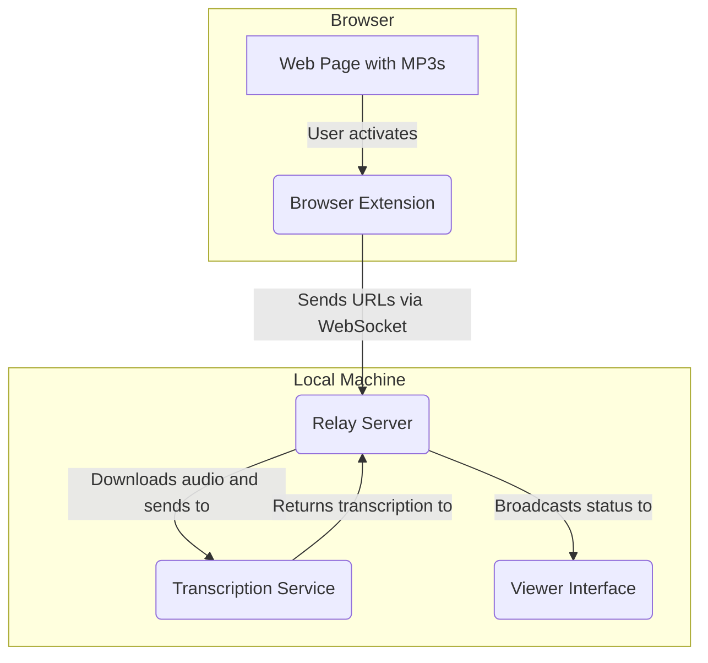

# MP3 Grabber & Auto-Transcription System

## Overview

This project is an automated system designed to find, download, and transcribe MP3 audio files from any webpage. It consists of a browser extension that captures audio links, a Node.js server that manages the process, and an integration with an AI-powered speech recognition service to perform the transcription.

## How It Works

The system operates through a seamless, multi-step process:

1.  **Audio Detection**: A browser extension, activated by a keyboard shortcut, scans the current webpage for any links to MP3 files.
2.  **Link Forwarding**: The extension sends the discovered MP3 URLs to a local Node.js relay server using a WebSocket connection.
3.  **Automatic Transcription**: The relay server downloads the audio from the URL and uses a local Whisper model to transcribe the speech into text.
4.  **Real-time Monitoring**: A web-based viewer page displays the status of each transcription job in real-time, showing "Processing," "Done," or "Failed."
5.  **View Results**: Once a transcription is complete, the text is displayed in the viewer.

## Architecture

The project is composed of three main parts:

-   **Browser Extension (`extension/`)**: A simple browser extension that finds all MP3 links on a page and sends them to the relay server.
-   **Relay Server (`relay.js`)**: A Node.js server built with Express and WebSockets. It receives URLs from the extension, downloads the files, manages the transcription queue, and serves the viewer interface.
-   **Viewer (`viewer.html`)**: An HTML page that connects to the relay server via WebSockets to provide a real-time view of the transcription process.



## Setup & Installation

To get the system running, follow these steps:

### 1. Install Dependencies

First, you need to install the necessary Node.js packages. Open a terminal in the project root and run:

```bash
npm install
```

### 2. Download the Transcription Model

This project uses `whisper-node` for transcription, which requires a pre-trained model. A script is included in `package.json` to download the recommended model (`base.en`).

Run the following command:

```bash
npm run download-model -- --model base.en
```

This will download the model and place it in the `whisper-bin` directory.

### 3. Load the Browser Extension

1.  Open your browser's extension management page (e.g., `chrome://extensions`).
2.  Enable "Developer mode."
3.  Click "Load unpacked" and select the `extension` folder from this project.

### 4. Start the Server

Finally, start the relay server:

```bash
npm start
```

The server will be running at `http://http://192.168.1.96/:8787`.

## Usage

1.  Open the viewer interface by navigating to `http://http://192.168.1.96/:8787` in your browser.
2.  Go to any webpage that contains links to MP3 files.
3.  Activate the extension using the shortcut `Ctrl+Shift+M` (or `Cmd+Shift+M` on Mac).
4.  The MP3 URLs will appear in the viewer, and the transcription process will begin automatically. 